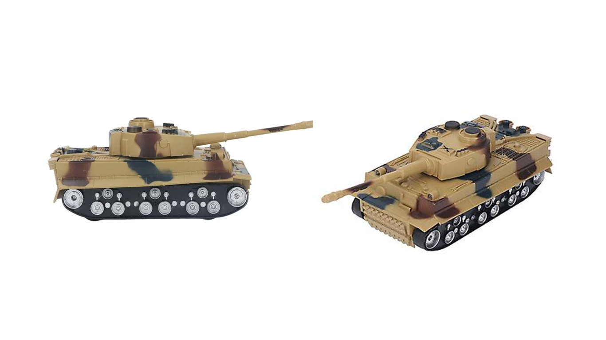
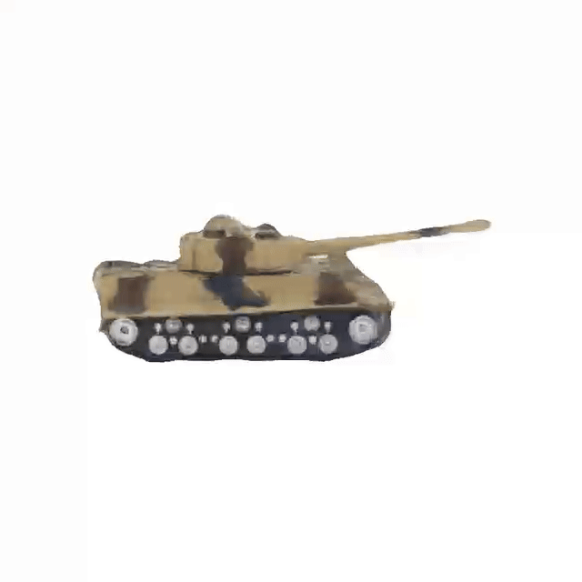

# NeRF Project 
Reconstruct 3D scenes with NeRF and Nerfstudio. 

Project for Fudan University Computer Graphics course, spring 2024. Instructed by Professor [Yan Bo](https://faculty.fudan.edu.cn/yanbo/en/index.htm).

## Demo
Nerfacto model render:


Splatfacto model render:


## Folder Structure
```
NeRF
  |__ assets               
        |__ report            // project report
        |__ slides            // project presentation slides
        |__ demo              // demo GIFs
  |__ eval                    // .json evaluation outputs
  |__ LICENSE 		             
  |__ models                 // trained models
        |__ nerfacto
        |__ splatfacto
  |__ notebooks              // Jupyter notebooks for training
  |__ README.md
```

## Dataset 
We first converted and extracted the video frames into images.

Then, we pre-processed 313 images of the M60 tank with COLMAP (feature extraction, feature matching, sparse reconstruction). 
- [Original video of the M60 Tank from Tanks & Temple Dataset](https://www.tanksandtemples.org/download/)
- [COLMAP pre-processed images of the M60 Tank (Kaggle)](https://www.kaggle.com/datasets/jinnywjy/tanks-and-temple-m60-colmap-preprocessed/data)

## Models
We trained and used Nerfstudio's Nerfacto and Splatfacto model. Training was done on Kaggle using the P100 GPU.  
- [Trained Nerfacto model](models/nerfacto/2024-06-07_011037)
- [Trained Splatfacto model](models/splatfacto)
- [Nerfacto training notebook (Kaggle)](https://www.kaggle.com/code/jinnywjy/nerfstudio-nerfacto-model)
- [Splatfacto training notebook (Kaggle)](https://www.kaggle.com/code/jinnywjy/nerfstudio-splatfacto-model)

## Model performance
PSNR (Peak Signal-to-Noise Ratio) is a measure of the peak error between the rendered image and the ground truth image, and it is expressed in decibels (dB). A higher PSNR value indicates better image quality and a closer match to the ground truth image.
| Dataset  | Model | PSNR |
|---|---|---|
| M60 Tank | Nerfacto  | 19.25  |
| M60 Tank  | Splatfacto  | 27.46  |

## Extras 
For the extra part of our project, we've decided to reconstruct a 3D model from a 2D toy tank image with DreamGaussian.


2D base image:



Generated 3D model:



## Documentation
For more details about the project, please check out our report and presentation slides.
- [Project report (PDF)](assets/NeRF-report.pdf)
- [Project presentation slides (PDF)](assets/NeRF-slides.pdf)

## License
Copyright © 2024 JinnyWong, Ng Yu Yue, Zhou Tao, Goh Xin Yie. 

Licensed under the MIT License.

